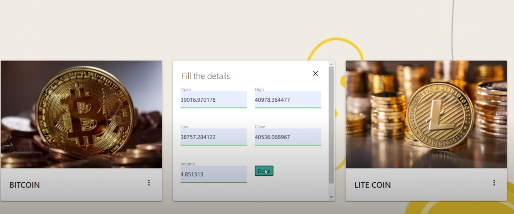
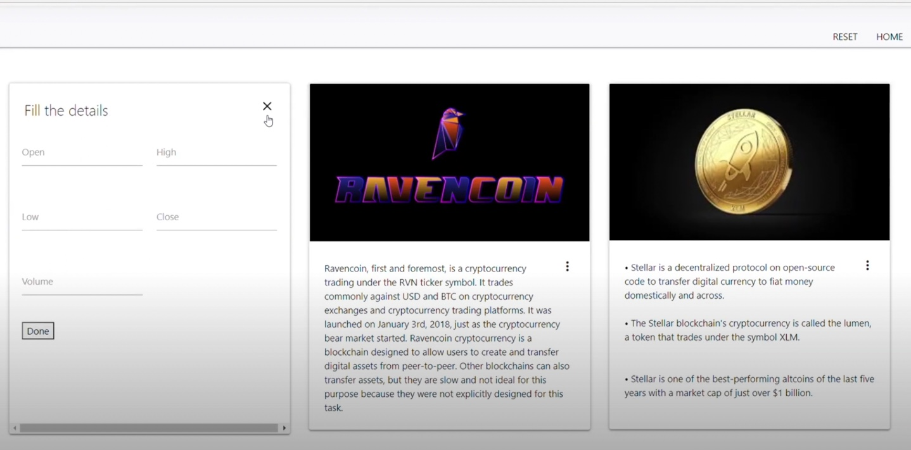

<h1 align="center"> 
<a> Dr.Crypto  </a> </h1>

A cryptocurrency is a form of digital asset based on a network that is distributed across a large number of computers. This decentralised structure allows them to exist outside the control of governments and central authorities.

### What Dr.Crypto does ?
**An interactive site to all crypto investors out there where it connects the broken bridge of market research . To invest on any crypto coin a ton of factors contribute for right , safe and secure investment . To ensure this , study about the coin is must , hence we bring you a one stop solution where it predicts the market cap ( Market Capitalisation -refers to how much a company is worth as determined by the stock market) of the particular coin you are interested in . This feature lets the investors study market cap of different coins and compare to choose the best and feasible one.**

Division of crypto coins :
* Popular Featured  : Cryptocurrencies like Bitcoin , Ethereum and Litecoin have a growing track record of holding and increasing in value over time, though recent dips have wracked the market, while lesser-known cryptos are considered much more speculative and unpredictable
* Penny : A penny cryptocurrency is a digital currency that is trading under $1. Much like penny stocks, the penny cryptocurrencies are very cheap coins literally worth a few pennies.
* Meme : Meme coins are an internet phenomenon embracing the technological and digital future.
* Dead : Dead Coins refer to cryptocurrencies that have been abandoned, used as scam, their website is down, has no nodes, has wallet issues, doesn't have social updates, has low volume or developers have walked away from the project.
The above division is done to enable users to understand the current market status of these coins .

Tech :
* Machine Learning
* Forecasting
* OLS(Ordinary Least Squares)
* Linear Regression
* Flask
* Materialize
* Bootstrap

### INSTRUCTIONS
* To check all machine learning models clone the repo and run it in your localserver
* commands: <pre>
    <code>
        python app.py
    </code>
</pre>

## Screenshots

 

</p

## Contact
Created by [Chiranthana R R](https://www.linkedin.com/in/chiranthana-r-r-232385200/) - feel free to contact me!

Created by [Timsal Zehra](https://www.linkedin.com/in/timsal-zehra-43863b1a6) - feel free to contact me!

Created by [Aditi Rastogi](https://www.linkedin.com/in/aditi-rastogi-961789191) - feel free to contact me!
